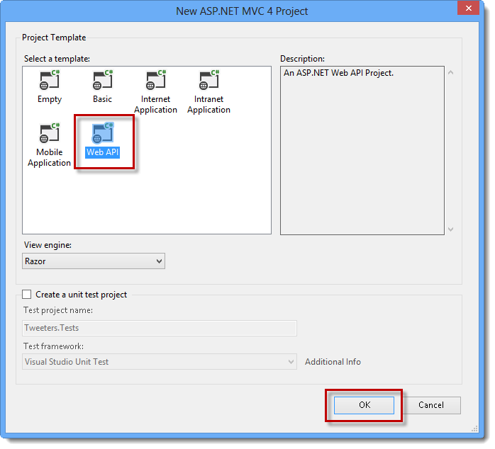
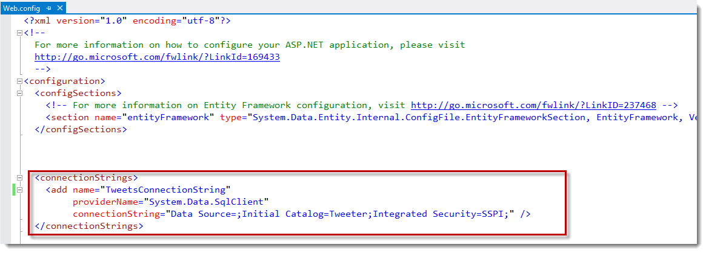
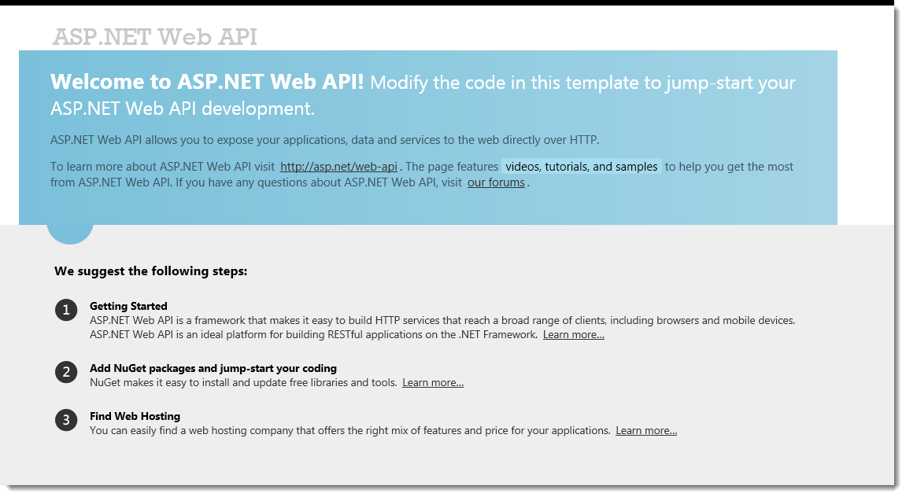
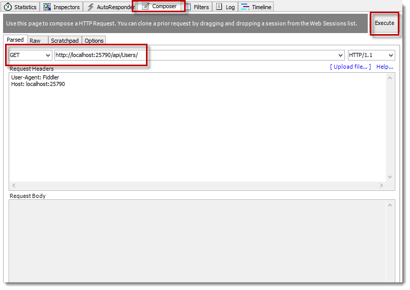
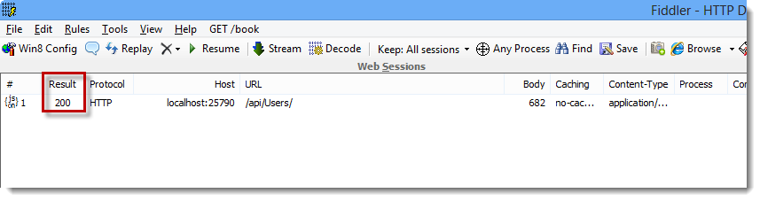

In this post, I’ll show you some of the basics on how to utilize Entity Framework 5.0’s “Code-First” features to develop a data access layer against an existing database. I’ll be demonstrating these concepts with a new MVC 4 Web API application and SQL Server 2012, but I won’t be covering either of those in this tutorial.

While Code-First is a great paradigm for starting a new application from scratch, you can also use it to map back to an existing database with ease.

Let’s pretend we’re working with a very simplistic Twitter model, as shown below.

Not a lot of meat here, a simple structure for Users and their Tweets. Of course, the real Twitter model is more complex, but this will suffice for the purpose of this tutorial.

To demonstrate how to accomplish this, we’re going to create a new MVC 4 Web API application in Visual Studio 2012, using C# AS our language. Our database will be running in SQL Server 2012.

After launching Visual Studio, navigate to `File | New | Project` dialog, and select Web from the installed templates navigation section, select ASP.NET MVC 4 Web Application, give your project a name, and click OK. 

I'm going to call mine, "Tweeters"

Once you’ve hit OK, another dialog will pop-up (below), asking what kind of MVC 4 web application you would like to create. Go ahead and choose "Web API" from the list, and press OK.

Once Visual Studio finishes creating the project, you should have a structure resembling the figure below:

By default, a new Web API project will have quite a number of files put in place for you. For the most part, we’re going to leave them alone.

Visual Studio 2012 automatically pre-installs Entity Framework 5.0 for us, so we’re ready to start coding! If you ever need to install it separately, however, you can find the package for download via NuGet.

The first thing I’m going to do is create two basic classes that represent our database tables. These 'models' will be placed in the Models folder of your application:

Let’s run through the code, so you can understand what’s going on.

If you notice the highlighted portions in the previous figure – these are attributes. We are using them to define some of the constraints we need to put on our models. Let’s go through each one in detail.
* `[Key]` – This tells EF that the property that directly follows is to be used as the Primary Key.
* `[Required]` – A value for this property must be supplied
* `[MaxLength(x)]` – Sets the length of the string EF will accept when saving

One thing to note is the property at the bottom of the Users class. You’ll notice we have an `ICollection<Tweets>;` – this lets EF know how to navigate through the objects to, in this case, the children "Tweets" of "Users". Essentially we’re setting up the database relationship between these two objects. So for the one-to-many relationship of Users & Tweets, we use a Collection.

If you refer back to our database model in the first figure, you’ll see that the `Required` and `MaxLength` attributes just replicate what our database will accept for these tables.

The next thing we have to do is create a database context. A context tells EF what database to connect to, and what models it expects.

Simply create a new class file (I’m calling mine `EntityContext`), and make it inherit from `DbContext`. This is a class provided by EF, so you’ll need to import the namespace to get access to it.

Once you have that, you’ll need a constructor. Notice, in our constructor, that we call into the base constructor and pass it a string. This is the connection string from the web.config that we want EF to use during database connections.

You’ll see that, in our constructor, we are setting the Initializer for our context to null with `SetInitializer<>`. This is very important. Since we’re connecting to an existing database, we don’t want EF to touch that database schema AT ALL. That’s what this is doing; telling EF NOT to try any database initialization logic – just connect, and leave it alone.

The next thing you’ll notice are the public `DbSet<>` properties. You want one of these for each model you want to interact with. In our case, we have Users and Tweets.

That’s all for the context. Pretty simple, huh? Let’s go define our connection string in the `web.config`.

Your connection string may differ from mine slightly, but I’m just connecting to a running database on my local machine.

Now we can go work on the controller that will be responsible for serving up some data from our database.

The first thing I’ve done is rename the `ValuesController` to `UsersController` just to make a little more sense. You don’t have to do this part if you don’t want, it doesn’t really matter in the long run, just remember what you call it when we go to make a request to the method.

We start out by creating an `EntityContext` reference object and instantiating it in the constructor. In the `Get` method, we simply call the context and grab the Users collection. (This is the `DbSet<Users>` we talked about in the context section)

This is all we need to do to start querying our database! Press F5 to start debugging the project (hopefully you have no errors). You should get a default webpage (below) discussing how to get started with a Web API project. We’re NOT going to pay any attention to this since we just want to query our database through the API call.

I’m going to fire up Fiddler to make a GET request to our API method.

By default, the API is running under an “api” route, and then the controller name. So to issue a GET of our Users, we just need to construct the URL in Fiddler’s Composer tab, with a GET method. Once you have that setup, hit "Execute".

In the figure below, we’re now looking at the result of our http request. You should hopefully get a result of 200. If so, double click on that line to switch over to see the results of your query.

If all has went well, you should see the result of your query, presented IN JSON format! Notice that we got back ALL of our Users, along with a collection of their Tweets. You might be wondering why we got back the Tweets, when we only requested the Users – this is due to the properties we added to the Users class letting it know that it has a collection of Tweets beneath it. Entity Framework is smart enough to work out the magic beneath the covers to populate the collections for us! Awesome!

### Conclusion
To recap, I showed you how to create a new ASP.NET MVC 4 Web API project that is backed by an existing database for querying through Entity Framework 5.0 Code-First.

Hopefully this tutorial has given you some basic insight into the capabilities of Entity Framework 5.0 Code First. I encourage you to keep digging into it, as this was only the tip of the iceberg!