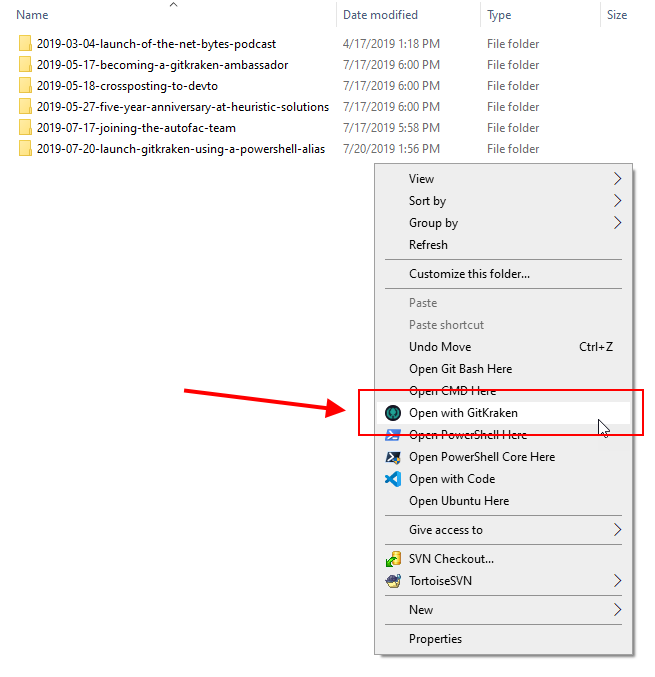
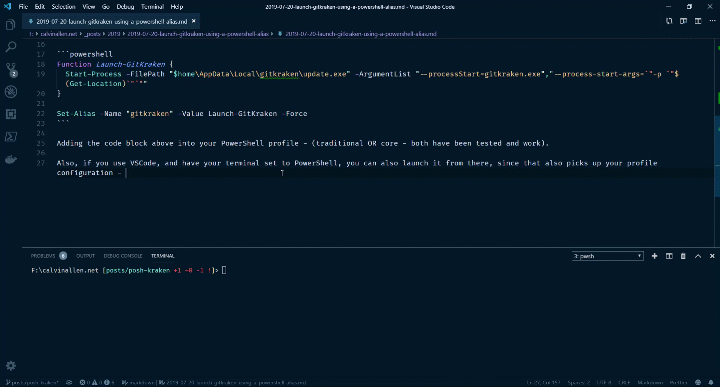

It's no surprise how much I love [GitKraken](https://www.gitkraken.com/git-client) (the single best Git GUI in existence), right?

At the same time, I still love the command-line (my preferred console at this point being [PowerShell Core](https://github.com/PowerShell/PowerShell/releases/tag/v6.2.2)).

I kept finding myself at the command-line, doing something in my local repository, and wanting to launch GitKraken without touching the mouse.

Since I'm on Windows, and the [GitKraken](https://www.gitkraken.com/git-client) installer adds a right-click context menu option, when right-clicking in a folder, of, "Open with GitKraken":


I knew the command-line parameters to do it existed - I just needed to find them.  Launch `regedit` and do a search for `gitkraken`, revealed the command I was looking for inside of:
> `HKEY_CLASSES_ROOT\Directory\Background\shell\GitKraken\command`

All I needed to do now was port that to a PowerShell alias of `gitkraken` (of course, you could change the alias however you see fit - `gk`, etc.).

Here is the code I ended up with, added to my PowerShell Profile.  Notice that I wrapped the [GitKraken](https://www.gitkraken.com/git-client) command in a Function, and then aliased that as I had trouble just trying to tie the GitKraken command into the alias directly (probably just my lack of PowerShell skills)

```powershell
Function Launch-GitKraken {
  Start-Process -FilePath "$home\AppData\Local\gitkraken\update.exe" -ArgumentList "--processStart=gitkraken.exe","--process-start-args=`"-p `"$(Get-Location)`"`""
}

Set-Alias -Name "gitkraken" -Value Launch-GitKraken -Force
```

Adding the code block above into your PowerShell profile - (traditional OR core - both have been tested and work).

Also, if you use [VSCode](https://code.visualstudio.com/), and have your terminal set to PowerShell, you can also launch it from there, since that also picks up your profile configuration - and here is an animated gif of that in action: (inception!)

[](posh-kraken.gif "click here for larger version")

[If you want to give GitKraken a try, do me a favor and sign up for trial using my referral code :)](https://luv2.dev/gitkraken)